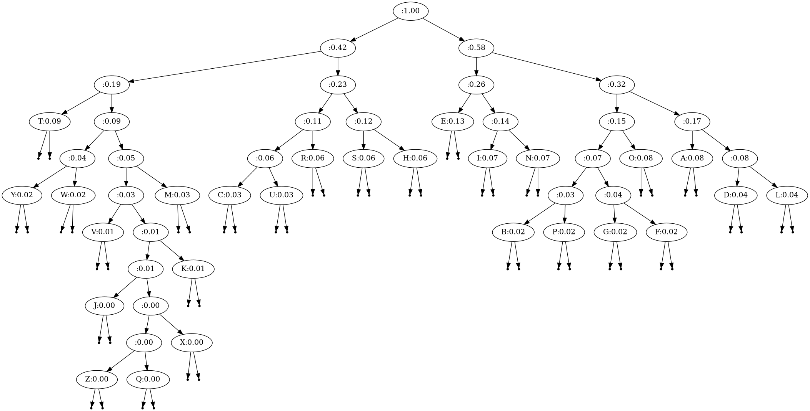

# Daily Coding Problem: Problem #1016 [Easy]

This problem was asked by Amazon.

Huffman coding is a method of encoding characters based on their frequency.
Each letter is assigned a variable-length binary string,
such as 0101 or 111110,
where shorter lengths correspond to more common letters.
To accomplish this,
a binary tree is built such that the path from the root to any leaf
uniquely maps to a character.
When traversing the path,
descending to a left child corresponds to a 0 in the prefix,
while descending right corresponds to 1.

Here is an example tree (note that only the leaf nodes have letters):

```
        *
      /   \
    *       *
   / \     / \
  *   a   t   *
 /             \
c               s
```

With this encoding, cats would be represented as 0000110111.

Given a dictionary of character frequencies,
build a Huffman tree,
and use it to determine a mapping between characters
and their encoded binary strings.

## Build and run

```sh
$ go build .
$ ./huffman -t -i better.tbl > better.dot
$ dot -Tpng -o better.png better.dot
$ ./huffman -i better.tbl > better.encodings
```

The `huffman` program can output [GraphViz](https://graphviz.org/) `dot` format representations
of both the min-priority tree it creates before constructing the
encoding tree, and the encoding tree.

Without a `-t` (dot-format encoding tree) or `-h` (dot-format heap) flag,
the `huffman` program prints out human readable table of symboly numeric values
and corresponding bits for each value.
I believe this satisfies the problem statement.

* `english.tbl` is a very simple proportion of letters in English text
table. Doesn't include anything other than upper-case ASCII values,
but that makes the encoding tree simpler to navigate.
* `better.tbl` is a byte frequency table based on a bunch of english text
I found on my laptop a while back. I also use this table of byte frequency
in [single-byte Xor decoding](https://github.com/bediger4000/singlexor),
to determine "closeness" of possibly decoded text to english text.



Above you see the output of `./huffman -i english.tbl -t > english.dot`
as rendered by the `dot` program of GraphViz.
That's the encoding tree,
with each node labeled with the english letter (if it's a leaf node)
and the proportion of that letter relative to the whole.
You can make out ETAOINHSRDLU as shorter-bit-representation symbols.
You can see that it's no wonder 'Z' and 'Q' are high value Scrabble letters.

## Analysis

"[Easy]".
I had no idea how to do this,
even after pondering for a while.
The [Huffman coding](https://en.wikipedia.org/wiki/Huffman_coding) wikipedia page
gives a "simple algorithm" that involves building a tree from a minimum priority queue,
where the priority of a character is that character's frequency.
Once you have the tree,
you can determine the bit patterns for each character by traversing the tree.
A left child gets a 0-bit, a right child gets a 1-bit at each level of recursion.
When the traverse reaches a leaf node,
it has all the bits for the symbol at that leaf.

## Interview Analysis

This really does not strike me as "[Easy]".
It involves 2 different data structures, a heap (used as a min-priority queue)
and a binary tree.
There's algorithms for adding and deleting elements to the min-priority queue,
and there's a traverse of the tree built from the queue,
which involves keeping track of left or right child recursion.

The O(n) method of constructing the encoding tree is completely inobvious.

Unless the candidate has recently gone through either of these algorithms,
they're not going to do well at this problem at all.
The interviewer is unlikely to get what they want out of the interview.
All in all, a very bad interview question.

## Further exploration

It might be a bad interview question,
but it's actually interesting to do this algorithm from the Wikipedia page.
The obvious next step is to build an encoder and a decoder.
Which I did.

```sh
$ go build cmd/encode.go
$ go build cmd/decode.go
$ go build cmd/table.go
$ find $GOPATH -name 'README.md' | xargs cat > big.txt
$ ./table big.txt > big.tbl
$ ./encode -i big.tbl -o readme.huff  ./README.md
$ ./decode -i big.tbl -o readme.plain readme.huff
$ ls -l README.md readme.huff readme.plain
```

When I do the above commands,
I see that `encode` says it outputs 4.815631 bits per rune.

```sh
480 % ls -l README.md readme.huff readme.plain
-rw-r--r-- 1 bediger bediger 3813 Oct 18 18:49 README.md
-rw-r--r-- 1 bediger bediger 2296 Oct 18 18:51 readme.huff
-rw-r--r-- 1 bediger bediger 3814 Oct 18 18:51 readme.plain
```

2296/3813 = 0.6021

4.815631/8 = 0.6019

`encode` really is getting the compression it says.

Running `./huffman -i big.tbl` says that you should get 5.098 bits per symbol.

Neither `encode` nor `decode` is spectacularly efficient code,
nor is either one "good" code.
They are just simple programs that allowed me to double check that
Wikipedia's claims about Huffman Encoding are correct,
and that a program can read prefix-free symbols from a stream of bits.

A Huffman encoder like I wrote would be a good choice
of compressor for [Normalized Compression Distance](https://en.wikipedia.org/wiki/Normalized_compression_distance)
because the dictionary that appears in output of general-purpose compressors
like `gzip` isn't included in my encoder's output.

### Symbol generation

It occurred to me that walking an encoding tree with a stream of random bits
allows you to generate streams of symbols that might be statistically similar to the
symbol distribution used to create the encoding tree.

```
$ go build cmd/recode.go
$ ./recode -i better.tbl -o random.txt
$ file random.txt
random.txt: Unicode text, UTF-8 text
$ go build cmd/table.go
$ ./table random.txt > random.tbl
$ join better.tbl random.tbl
09 0.001816 0.0019
0a 0.025974 0.0318
20 0.148642 0.1244
21 0.000148 0.0001
22 0.002398 0.0020
23 0.000461 0.0004
 ...
```

Looks like the character frequency is close, but not exact.
I don't know if one of those markov chain generators would do better.
